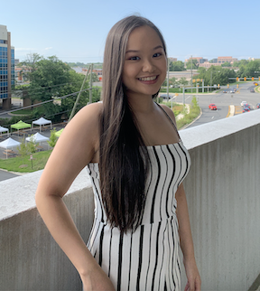

# Wicked Problems

## Introduction

Hello! My name is Quyen Tran and I'm currently a freshman at William & Mary. I'm planning on majoring in chemistry on the premed track with a minor in public health!
I'm from Springfield, Virginia and have lived here my whole life. I love to travel, bake, and binge Netflix.

## Informal Responses
[Reflection 1](reflection1.md)

[Reflection 2](reflection2.md)

[Reflection 3](reflection3.md)

[Reflection 4](reflection4.md)

[Reflection 5](reflection5.md)

## Projects
[Project 0 - Getting Started With R](gettingstarted.md)

[Project 1 - Projecting, Plotting and Labelling Administrative Subdivisions](project1.md)

[Project 2 - Extracting Populations from a Raster and Aggregating to each Unit](project2.md)

[Project 3 - Spatial Population Modeling](project3.md)

[Project 4 - Modeling and Predicting Spatial Values](project4.md)

[Project 5 - 3D LMIC Modeling](project5.md)
