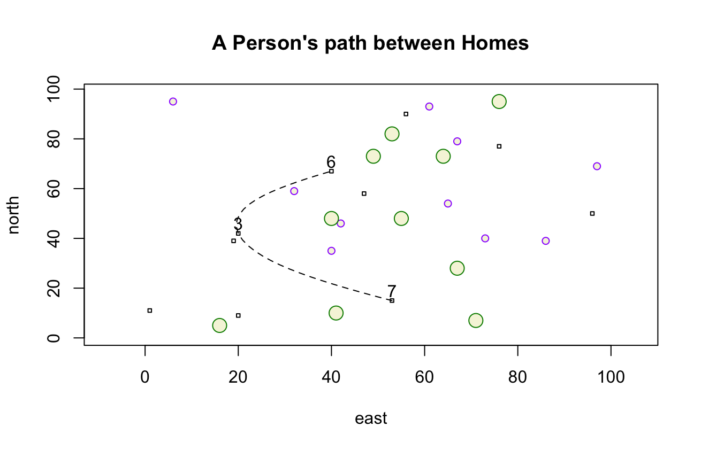

# Getting Started With R

In this first plot, an xspline curve connects three points along with squares (houses), small circles (small trees), and big circles (bigger trees).

In this second plot, the xspline curve marks the path a person took between seven homes.

