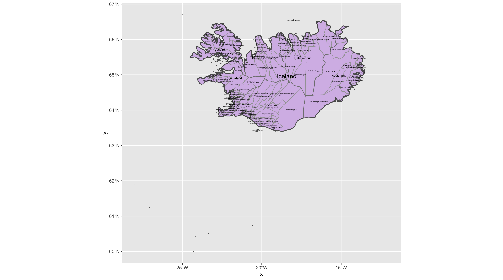
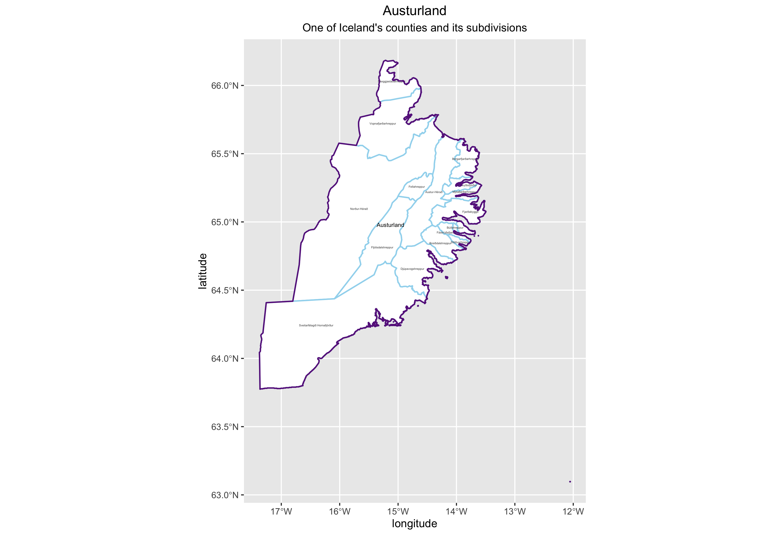

## Projecting, Plotting and Labelling Administrative Subdivisions

In this project, I used ggplot to map Iceland.

For stretch goal 2, I plotted one of Iceland's counties, Austurland, and its subdivisions.

