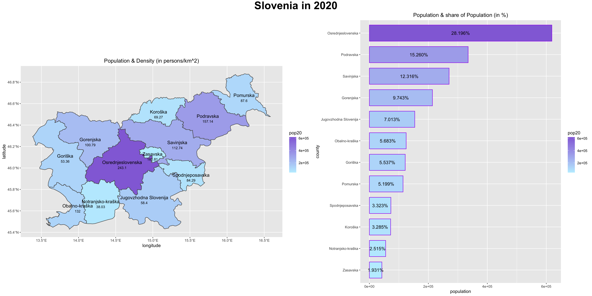
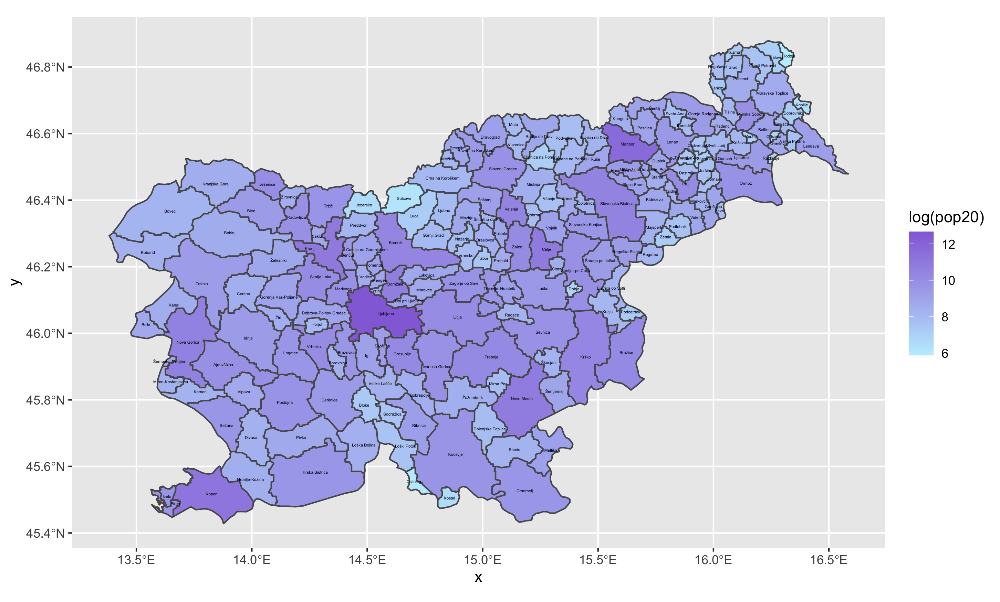
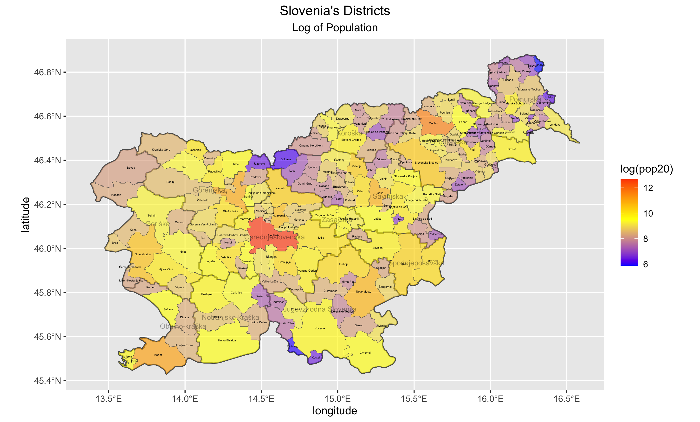

## Extracting Populations from a Raster and Aggregating to each Unit

For this project, I used ggplot to map Slovenia and its counties along with a bar graph that shows each county according to their population density. The counties are color-coded based on their population counts while the bar graph organizes Slovenia's counties in order of decreasing population density.

For stretch goal 1, I plotted Slovenia's municipalities. They are also color-coded based on the log of their population counts.

For stretch goal 2, I plotted Slovenia's counties as well as its municipalities. Its municipalities are color-coded based on the log of their population counts.

For stretch goal 3, I created a 3D plot of Slovenia's municipalities. They are color-coded by the log of their population counts.

