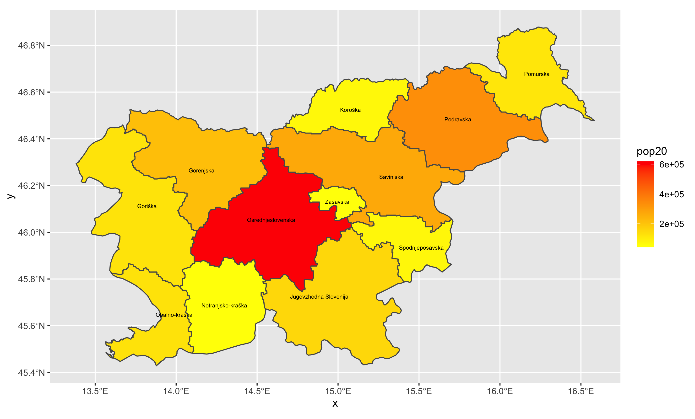

## Extracting Populations from a Raster and Aggregating to each Unit

In this project, I used ggplot to map Slovenia and its counties. The counties are color-coded based on their population counts.

