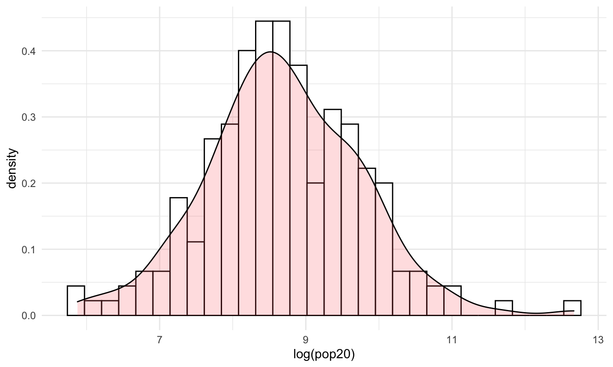
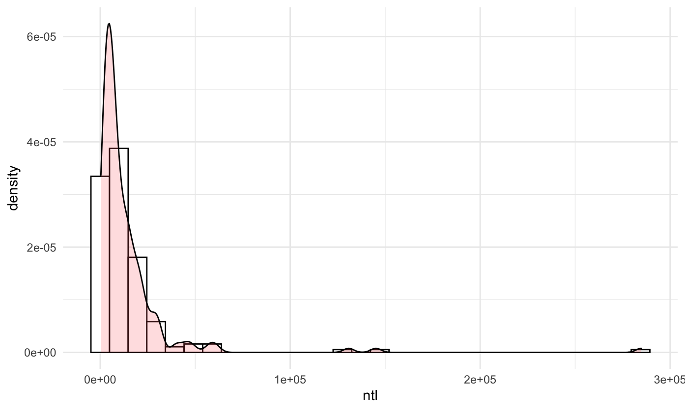
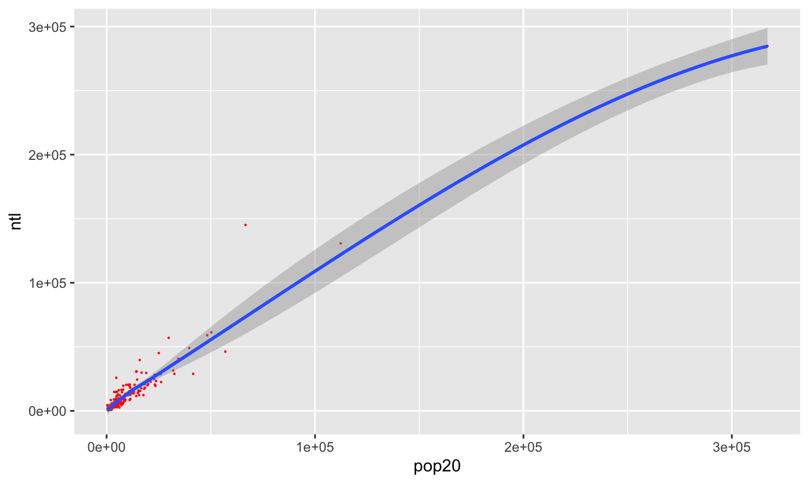
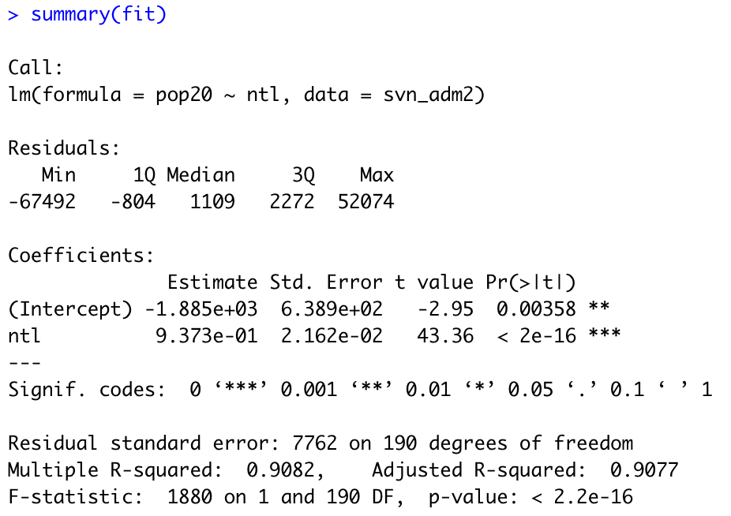
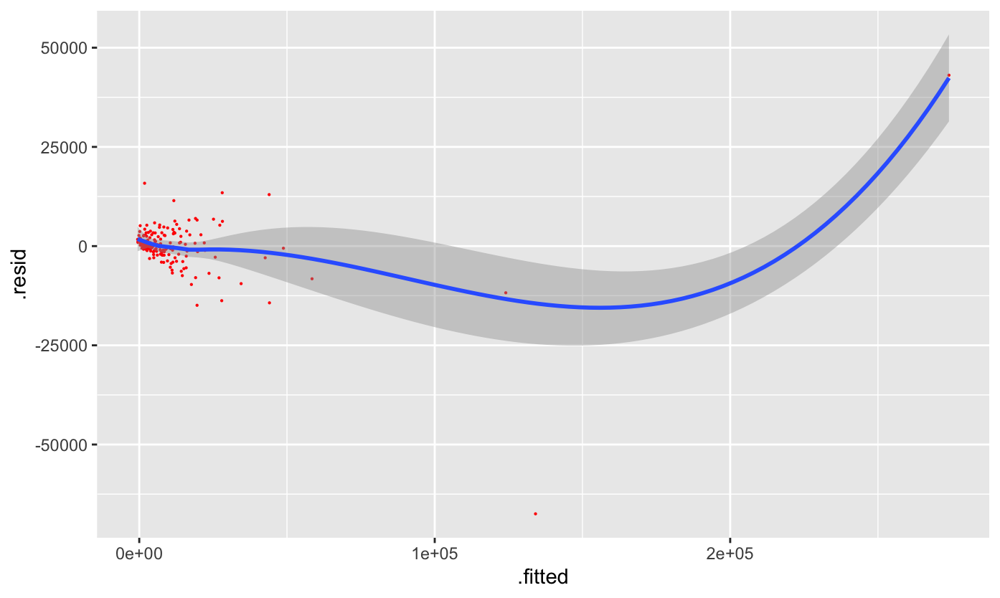
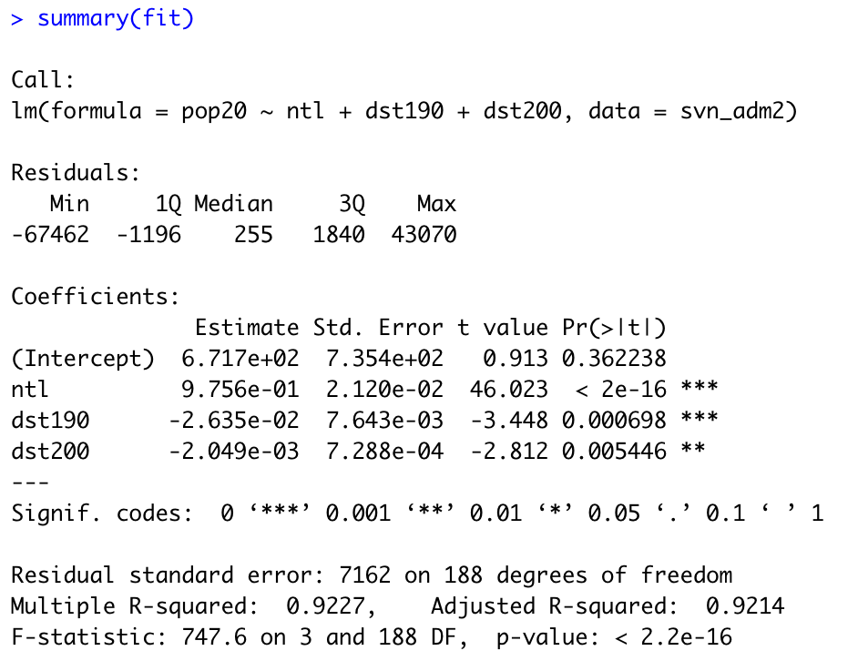

For this project, I used ggplot to create different graphical models of Slovenia's municipalities' population counts in relation to several variables.

This first histogram depicts the correlationship between the log of the population counts and the density of Slovenia's regions.

This second histogram depicts the correlationship between night time lights and the density of Slovenia's regions.

This first line plot depicts the relationship between Slovenia's population in 2020 (the dependent variable or response) and night time lights of Slovenia's regions (the independent variable or predictor).

As seen in this line plot's summary, a relationship exists because the r squared value is approximately 0.9.

This second line plot depicts the relationship between Slovenia's population in 2020 as the dependent variable (response) and with night time lights, urban cover, and bare cover as the independent variables (the predictors).

As seen in this line plot's summary, a relationship exists because the r squared value is approximately 0.9.

