For this project, I estimated spatial values across Slovenia and plotted the predicted populations of different regions using Worldpop's 2020 data.

These first four plots depict predicted spatial values of the two most populated cities in Slovenia at the first and second administrative divisions.

1. This plot depicts the population of the Osrednjeslovensk region at the first administrative level.
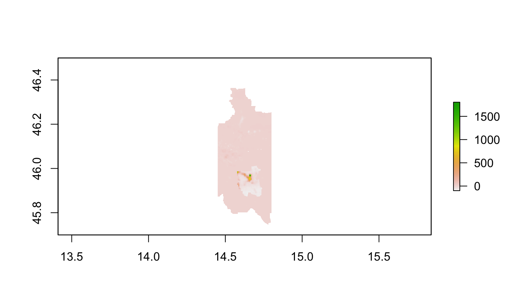

2. This plot depicts the population of Ljubljana, Slovenia's capital city located in the Osrednjeslovensk region, at the second administrative level.
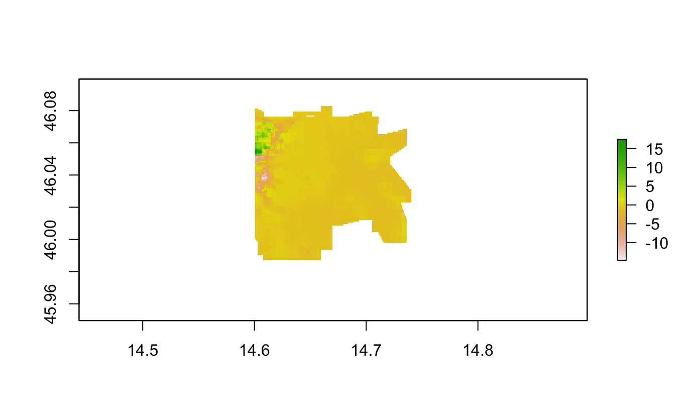

3. This plot depicts the population of Podravska region at the first administrative level.
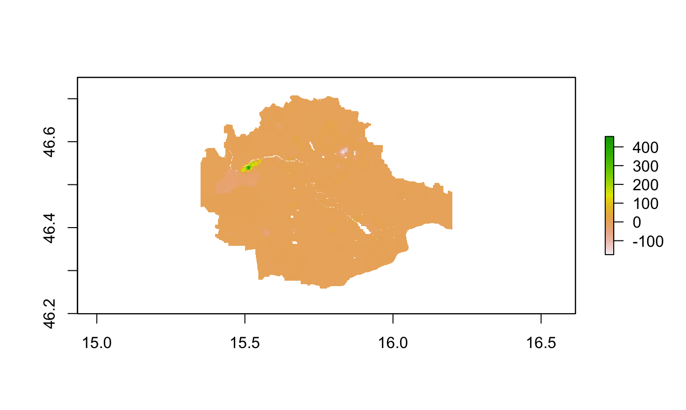

4. This plot depicts the population of Maribor, Slovenia's second most populous city, located in the Podravska region, at the second administrative level.
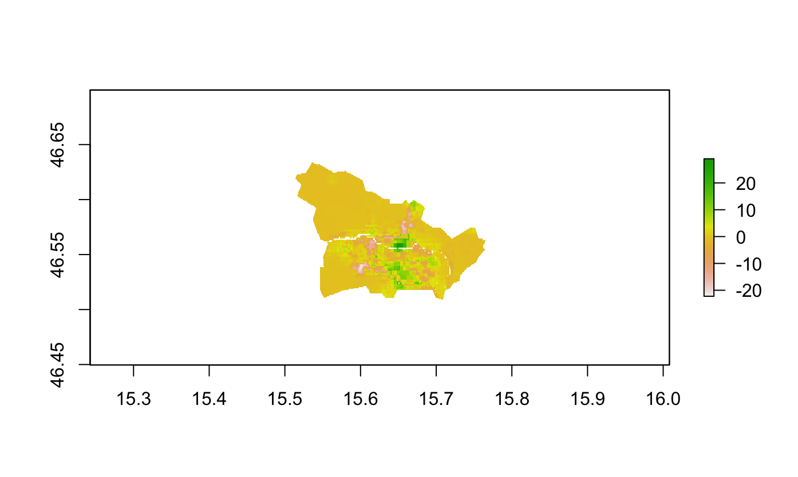

These plots depict the predicted population of Slovenia based on three different models.

In these next three plots, the response variable is population and the predictors are the sum of covariates.

1. This plot is the model's predicted population of Slovenia.

2. This plot depicts the difference the predicted and actual population of Slovenia.

3. This is a 3D plot of the difference in the predicted and actual population of Slovenia.

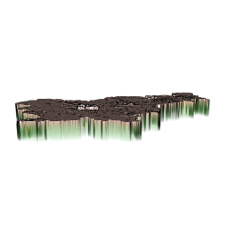

For the following three plots, the response variable is population and the predictors are the mean of covariates.

1. This plot is the model's predicted population of Slovenia.
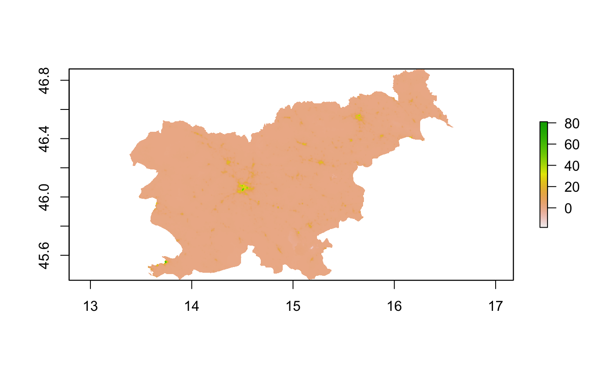

2. This plot depicts the difference the predicted and actual population of Slovenia.
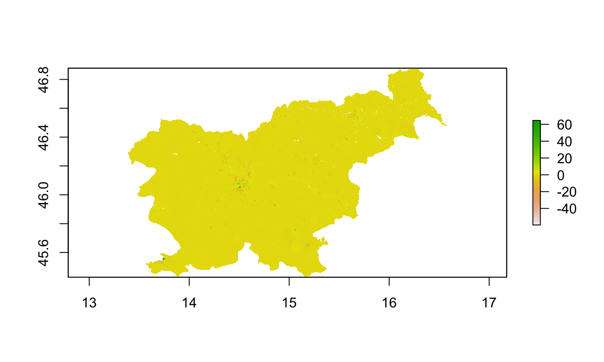

3. This is a 3D plot of the difference in the predicted and actual population of Slovenia.

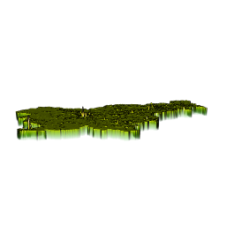

In these last three plots, the response variable is log of population and the predictors are the mean of covariates.

1. This plot is the model's predicted population of Slovenia.
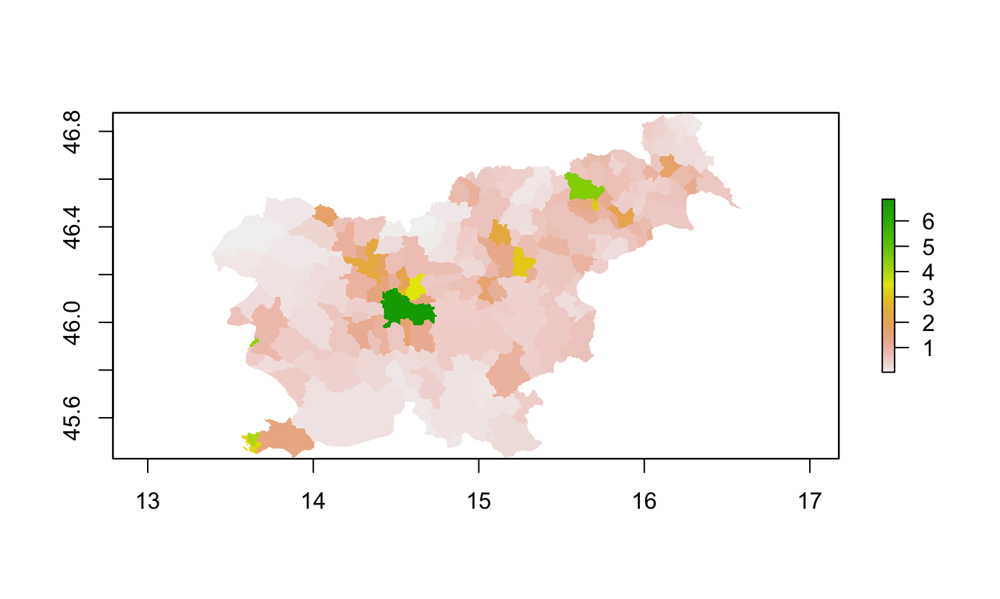

2. This plot depicts the difference the predicted and actual population of Slovenia.
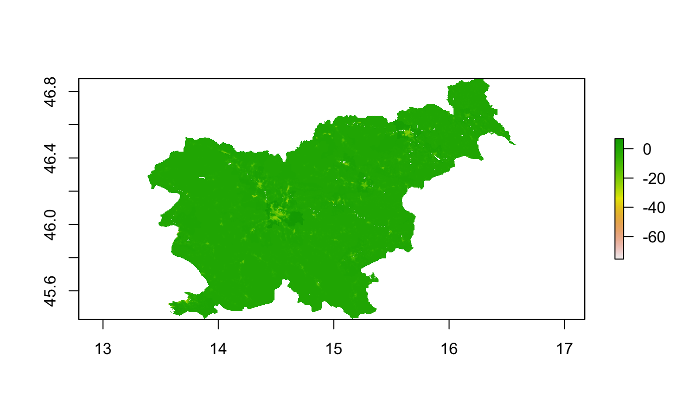

3. This is a 3D plot of the difference in the predicted and actual population of Slovenia.

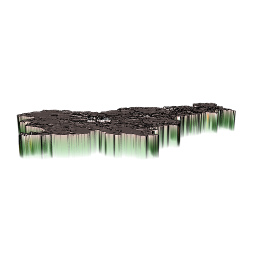
