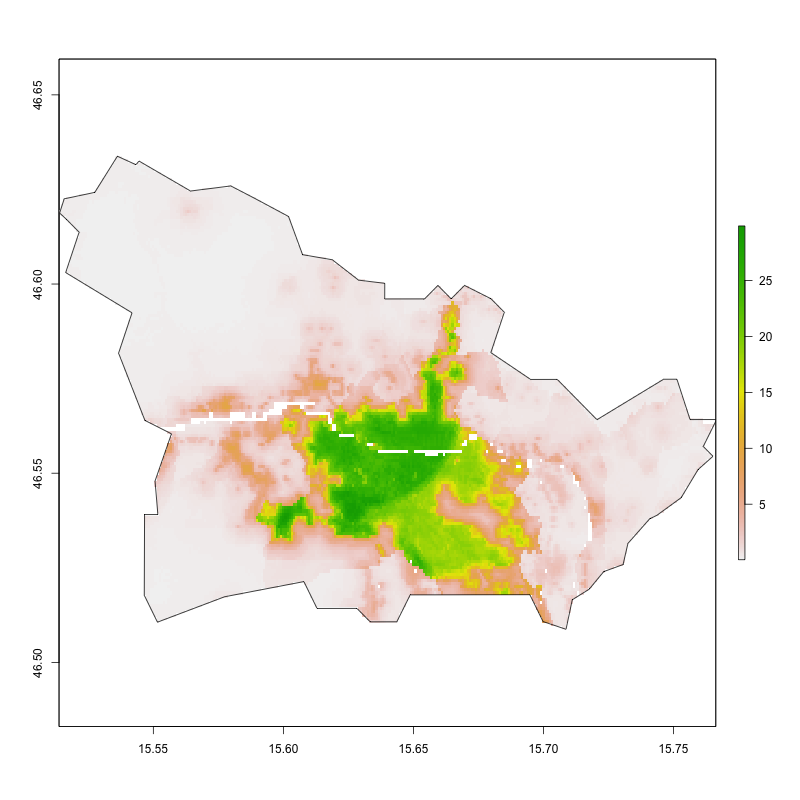
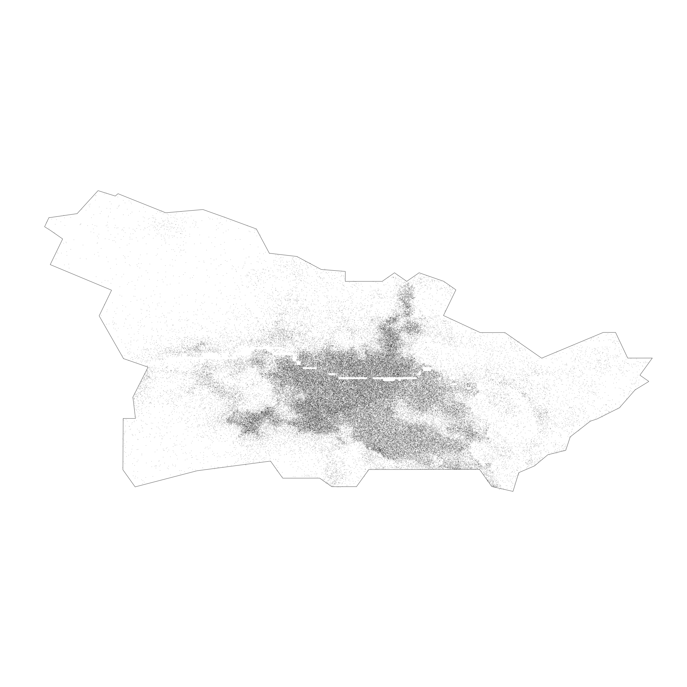
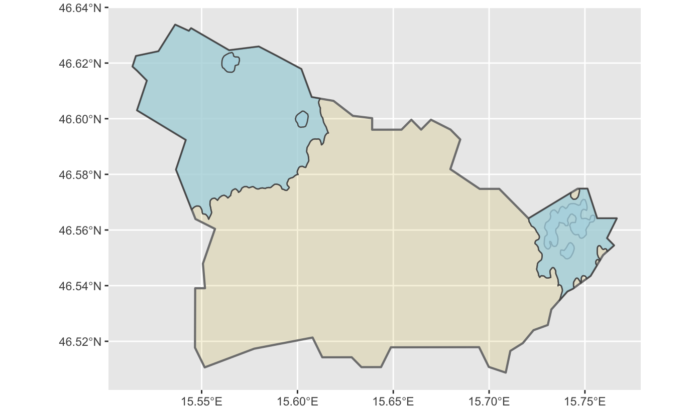
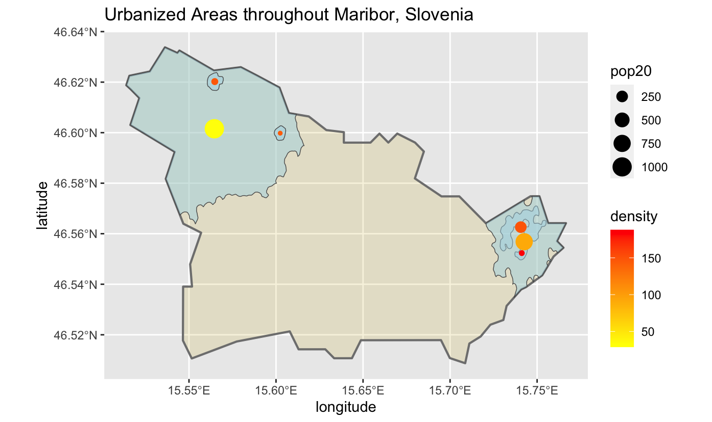
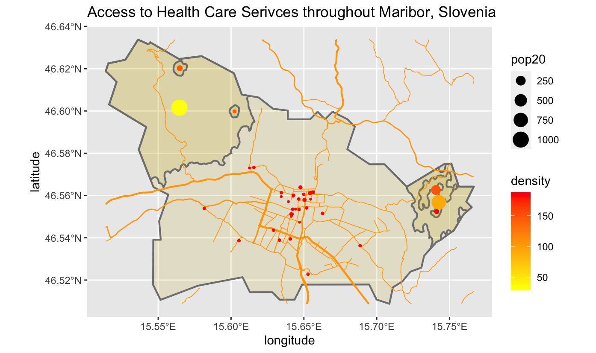
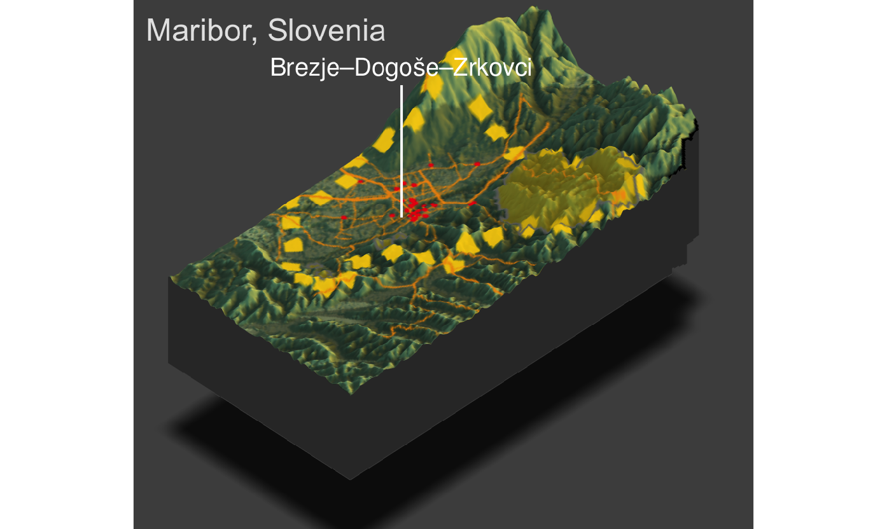

In this project, I worked on distributing the population among the second administrative boundaries of Maribor city in Slovenia.

This first plot depicts the cropped and masked data of the world pop person per pixel raster of Maribor.

This next plot is the spatial probability distribution of the population in Maribor. 

This third plot highlights the de facto human settlements and urban areas of Maribor. 

This plot uses population and density data to describe the de facto human settlements and urban areas Maribor.

Then, I created a plot that depicts the location of de facto human settlements, urban areas, roadways, and health care facilities throughout Maribor.

Maribor's population is estimated to be around 112287 with 4 distinctly defined urban areas. These areas are mainly in the northwest and the east of the city with the more denser regions lying in the east. However, the roadways are mainly connecting the center area of the city, where most of the health care facilities are.

This last plot is a 3D representation of Maribor and the de facto location of human settlements and urban areas, roadways, and health care facilities with their respective topography.

